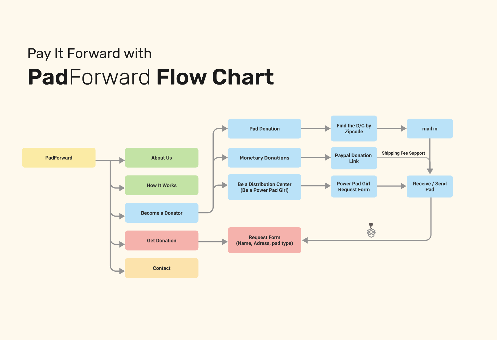

# PadForward, Pay It Forward

## About PadForward
**"PadForward: Together, We Can End Menstrual Inequity"**

Have you ever found yourself with a stash of menstrual products that suddenly seem unnecessary as your periods come to an end? Instead of discarding them, imagine turning those surplus supplies into a beacon of support for someone in need. This is where PadForward comes into play, inviting you to not just share the menstrual products but also the wisdom and warmth that got you through your own cycles.

Imagine a community where the end of your menstrual journey becomes the beginning of support for another. Every pad you've saved, every tip you've learned, carries the potential to ease someone else's challenges. PadForward isn't just about donating menstrual products; it's about passing on a legacy of care, strength, and shared experiences.

## How It Works

## PadForward Preview

[Figma Prototype](https://www.figma.com/proto/hsHL8aHqyX4ylm5rntEmIC/PadFoward?page-id=0%3A1&type=design&node-id=0-10&viewport=912%2C1434%2C1&t=4BlkhohKj0K97XdV-1&scaling=min-zoom&mode=design)
